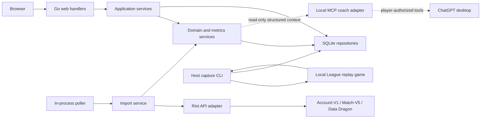

# Journalol technical implementation plan

Status: living plan; foundation, Riot import, MCP coach context, and replay capture implemented
Based on: [`prompt.md`](./prompt.md)  
Last reviewed: 2026-08-02

## 1. Product outcome

Journalol should make one improvement loop easy:

1. Choose a small, explicit training focus.
2. Review that focus before queueing.
3. Import the completed game automatically.
4. Record a useful reflection in less than one minute.
5. Use several games—not one result—to decide what to practice next.

The product is a private training journal with supporting match data. It is not a
general player lookup, live-game overlay, build recommender, MMR estimator, or
replacement for OP.GG.

The first release is successful when one player can run the app locally, use
demo data or connect a Riot account, complete the loop above, and see honest
progress for an active training block.

## 2. Scope and delivery boundary

### Core MVP

- Single local player profile identified by Riot ID, tag line, and platform.
- Demo mode that exercises the full product without a Riot API key.
- Durable, restart-safe import of match detail and timeline data.
- One active training block with automatic and manual targets.
- A fast post-game review queue.
- Match list, detail, filters, note search, and annotations.
- Dashboard trends for 10, 20, and 50 eligible games.
- Champion pool and session planning.
- Optional host-side death clips from a replay the player downloaded locally.
- JSON/CSV export plus safe SQLite backup and restore.
- Docker Compose setup and complete local documentation.

### Deferred

- Embedded provider-backed AI chat and autonomous coach write actions.
- Multiple profiles, accounts, or cloud sync.
- Riot Sign On (RSO), which is unnecessary for a private single-user app.
- Live Client API, spectator integration, live overlays, or advice during play.
- Broad opponent scouting, public profiles, rankings, or build statistics.
- A native mobile app.

Phase 4 is an internal training-loop milestone. The complete non-AI MVP
described in the prompt ends at Phase 6, after champion/session tools,
portable backup/restore, documentation, and release hardening are present.

## 3. Technical decisions

| Area | Decision | Reason |
| --- | --- | --- |
| Deployment | One Go process in one container | The app, scheduler, and database have one user and one lifecycle. |
| Backend | Go modular monolith using `net/http`/`chi` and `slog` | Small operational surface with explicit package boundaries. |
| UI | Server-rendered `html/template`, HTMX for small interactions, minimal vanilla JS | Avoid a separate SPA and Node runtime while keeping the review flow responsive. |
| Charts | Vendored Chart.js | Small, familiar, and usable without a CDN. |
| Storage | SQLite through `modernc.org/sqlite` | Local-first and CGO-free container builds. |
| Queries | `database/sql` plus generated `sqlc` queries | Typed queries without introducing an ORM. |
| Migrations | Numbered SQL migrations embedded in the Go binary | Reproducible startup and backup/restore validation. |
| Background work | One in-process scheduler and durable job table | Restart safety without a broker or second worker container. |
| Static Riot data | Versioned Data Dragon metadata/assets cached locally | Display IDs using the closest applicable game patch and tolerate offline use. |
| Secrets | Environment/file-backed secret store, never SQLite | Keep Riot and future model keys out of database backups and exports. |
| Time | Store UTC; render in the configured local timezone | Avoid ambiguous sessions and date-boundary bugs. |
| Analytics | Named, versioned metric registry | One definition feeds targets, dashboards, exports, and future coaching. |
| Missing data | Nullable value plus availability/provenance state | A missing timeline must never silently become a zero. |

No separate API service, frontend service, database container, Redis instance,
or message broker is justified for the initial product.

## 4. System architecture



The application has four important boundaries:

- **Web boundary:** HTML and JSON handlers validate input and call application
  services. Business rules do not live in handlers or templates.
- **Riot boundary:** one client owns routing, authentication, throttling, retry,
  DTOs, and sanitized errors. No browser code calls Riot directly.
- **Persistence boundary:** repositories and transaction helpers isolate
  SQLite. Domain services do not issue ad hoc SQL.
- **Analysis boundary:** the metric service produces structured, attributable
  observations. Dashboard summaries and the read-only MCP coach consume the
  same facts. Any future provider-backed coach must use this same boundary.

Use interfaces at external or test-sensitive boundaries (`RiotClient`,
repositories, clock, secret store, and later `CoachProvider`). Avoid an
interface for every internal type.

### Suggested repository layout

```text
cmd/journalol/
  main.go
internal/
  app/                    # use cases and transaction boundaries
  config/
  domain/
    match/
    training/
    review/
    session/
    champion/
  riot/                   # routes, HTTP client, DTOs, throttling
  importer/               # discovery, jobs, raw storage, normalization
  metrics/                # registry, evaluators, trends, summaries
  background/             # polling scheduler
  capture/                # death-event planning and managed capture lifecycle
  replay/                 # loopback Replay API and macOS game launcher
  leagueconfig/           # reversible game.cfg transaction and recovery
  store/sqlite/           # repositories and generated queries
  export/                 # JSON, CSV, backup, restore
  web/                    # handlers, middleware, view models
  coach/                  # added in the optional AI phase
migrations/
web/
  templates/
  static/                 # CSS, HTMX, Chart.js, small bundled icons
testdata/
  riot/                   # versioned match/timeline fixtures
  demo/
Dockerfile
compose.yaml
```

## 5. Riot integration plan

### Identity and routing

The setup form asks for `game name`, `tag line`, and League platform such as
`NA1` or `EUW1`. Region is still required because Riot does not provide a
reliable League shard discovery step for an arbitrary Riot ID.

Use the following request sequence:

1. `ACCOUNT-V1`: resolve Riot ID to PUUID with
   `/riot/account/v1/accounts/by-riot-id/{gameName}/{tagLine}`.
2. `SUMMONER-V4`: optionally fetch League profile metadata such as profile icon
   and level using `/lol/summoner/v4/summoners/by-puuid/{puuid}`. Do not make
   the domain model depend on legacy Summoner Name or summoner-ID lookups.
3. `MATCH-V5`: discover match IDs using
   `/lol/match/v5/matches/by-puuid/{puuid}/ids`.
4. `MATCH-V5`: fetch `/lol/match/v5/matches/{matchId}`.
5. `MATCH-V5`: fetch `/lol/match/v5/matches/{matchId}/timeline` independently.

Keep the platform-to-regional mapping (`NA1 -> AMERICAS`, `EUW1 -> EUROPE`,
and so on) in one tested, data-driven package. Riot uses platform hosts for
some endpoints and regional hosts for Account-V1/Match-V5; the two are not
interchangeable, and platform assignments can change. Use PUUID as the stable
internal Riot identity and Riot ID as mutable display data.

There is no documented completion webhook for ordinary Match-V5 games.
Automatic discovery is therefore polling: run once at startup, every five
minutes by default, and whenever the user requests a sync. Tournament callbacks
are unrelated to normal match history and are out of scope.

### Key handling

Riot development keys expire every 24 hours, so key replacement must be an
obvious setup action.

The intended rollout is development key for initial work, a registered personal
key for the private prototype, and a production application/key before any
public alpha or beta. Riot currently documents personal-key limits of 20
requests per second and 100 per two minutes per region; code must still learn
and obey the limits returned for the actual key rather than assuming those
numbers.

Secret resolution order:

1. `RIOT_API_KEY` or `RIOT_API_KEY_FILE`, when set by the operator.
2. `/data/secrets/riot_api_key`, written atomically with mode `0600` by the
   local setup UI.

Environment/file values supplied by the operator are read-only in the UI and
clearly labeled with instructions to update Compose and restart. When neither
operator value is set, the UI-managed file can be replaced or removed without
restarting.

The API must never return the key after it is submitted. Show only source,
validation status, last validation time, and a short fingerprint. Never log the
key, request authorization header, or URLs containing it. Database backup,
restore, JSON export, and CSV export exclude the secret directory.

### Durable import state machine

`import_jobs` makes every match restart-safe:

```text
pending
  -> detail_fetched
  -> detail_normalized
      -> timeline_fetched -> complete
      -> timeline_retry_wait
          -> timeline_fetched -> complete
          -> partial_timeline
partial_timeline --manual/scheduled recovery--> timeline_retry_wait
any retryable detail step -> retry_wait --resume_step--> saved step
any terminal detail error -> failed
```

The detail response is sufficient to create a usable match. Timeline failure
must lead to `partial_timeline`, not loss of the whole match. Partial timelines
remain eligible for a later manual or scheduled recovery attempt.

For each sync:

1. Create a `sync_runs` record with trigger `startup`, `poll`, or `manual`.
2. Fix `endTime` to the sync-run start and fetch an overlapping page of IDs
   (20 by default).
3. Insert unknown IDs into `import_jobs`; the unique match ID makes this
   idempotent.
4. Keep paging whenever a page contains unseen IDs. Stop only after reaching a
   full known boundary, the configured catch-up cap, or API exhaustion.
   Persist the fixed `endTime` and next page offset on the sync run; when the
   cap is reached before a known boundary, resume that same run before starting
   a newer poll. Initial setup uses the chosen history limit (default 20, up to
   100) as an explicit boundary.
5. Fetch and persist the raw detail payload before normalization.
6. Normalize the match and the primary player's participant row in a short
   transaction.
7. Fetch/persist the timeline separately and normalize only selected events.
8. Compute versioned per-match metrics.
9. Associate the match to the training block active at game time and any open
   session whose time window contains it.
10. Put an eligible, unreviewed match into the review queue.

Do not rely only on a timestamp cursor; overlapping discovery covers delayed
results and interrupted imports. A manual backfill can explicitly request
older pages.

### Rate limits and failures

The Riot client owns a shared regional rate-limit coordinator:

- Proactively pace requests based on observed application and method headers.
- Track application, method, and service limits separately by routing region;
  one endpoint's bucket must not stand in for every limit.
- On `429`, stop the relevant bucket for the exact `Retry-After` duration.
- Retry network errors and `5xx` with capped exponential backoff and jitter.
- Treat match/timeline `404` as a typed data state; retry only when policy says
  it could be eventual consistency, then mark unavailable.
- On `401`/`403`, pause all polling, keep jobs durable, and show
  `API key or Riot endpoint/routing configuration needs attention`. Validate
  the key independently before attributing every `403` to expiry; Riot also
  uses `403` for unsupported or incorrect paths.
- Sanitize non-200 bodies because Riot does not guarantee their schema.
- Apply timeouts, response-size limits, and bounded concurrency.

Store attempts and `next_attempt_at` so restarts do not reset backoff. The UI
shows the last successful sync, current run, partial matches, and a sanitized
actionable error.

### Static data

Cache versioned Data Dragon champion, item, rune, and spell metadata. Match the
major/minor patch from `gameVersion` to the newest applicable Data Dragon build,
but retain every numeric ID and a display-name snapshot. Data Dragon can lag a
game patch, so an unknown ID renders as `Unknown item (1234)` rather than
breaking import.

Cache Riot's queue/map constants similarly instead of scattering queue IDs
through application code. Demo data includes the small asset subset it needs,
so the interface remains useful offline.

## 6. Metric definitions and data honesty

All metrics are registered in code:

```text
key
label and unit
source requirements
applicable queues/roles
favorable direction
minimum sample size
evaluator version
```

Each computed value has:

- `available`, `not_applicable`, `source_missing`, or `unsupported`;
- `match`, `timeline`, `manual`, or `derived` provenance;
- `exact`, `derived`, or `heuristic` confidence;
- an evaluator version.

Apply Riot's documented “omitted numeric field means zero” rule only inside a
successfully decoded, applicable DTO. A missing participant, missing timeline,
or malformed response remains unknown; omission semantics must not cross a
source boundary.

Initial definitions:

| Metric | Definition | Missing-data rule |
| --- | --- | --- |
| Result | Primary participant `win` flag | Unknown if the participant cannot be matched by PUUID. |
| KDA | `(kills + assists) / max(1, deaths)` | Available from match detail. Also show the raw K/D/A. |
| CS | `totalMinionsKilled + neutralMinionsKilled` | Available from match detail; do not imply it is equally meaningful for every role. |
| Damage | Total damage dealt to champions | Label it “champion damage,” not generic damage. |
| Vision/min | `visionScore / (durationSeconds / 60)` | Unknown for invalid/zero duration. |
| Wards placed/killed | Participant match fields | Preserve Riot's reported value. |
| Control wards purchased | Participant `visionWardsBoughtInGame`; timeline `ITEM_PURCHASED`/`ITEM_UNDO` reduction supplies purchase timing and validation | For a valid participant DTO, Riot's documented omitted-numeric rule makes an omitted field exact zero. Unknown is reserved for missing/malformed participant detail; retain a quality warning if a complete timeline disagrees. |
| Items | End-of-game item slots from match detail | Purchase sequence is separate and timeline-dependent. |
| Runes/spells | Participant perks and summoner spell IDs | Preserve raw IDs if static metadata is missing. |
| Skill order | Ordered `SKILL_LEVEL_UP` timeline events | `source_missing` without a timeline. |
| Objective participation | Player listed as killer or assister on supported elite-monster events | Derived and nullable; team objective count is not individual participation. |
| Role | Prefer `teamPosition`, with explicit fallback rules | `unknown` for modes where standard roles do not apply. |

“Arrived before dragon,” “avoided facechecking,” and “tracked the enemy jungler”
are manual check-ins in the MVP. Timeline frames are too coarse to prove those
behaviors reliably. A future, validated heuristic may be added under a new
metric key/version and must be labeled as an estimate.

Confirmed remakes remain visible but are excluded from trend and target
aggregates by default. Use Riot's available early-end indicators, with a
documented duration fallback; preserve the reason and evaluator version.

Dashboard comparisons use equal, adjacent windows and state their sample size.
For example, “Deaths fell from 7.1 to 5.4” compares the latest 20 eligible games
with the preceding 20, not an arbitrary historical baseline. Suppress narrative
claims below the metric's minimum sample size.

## 7. Database schema

Use foreign keys, UTC timestamps, `CHECK` constraints for state machines,
partial unique indexes for single-active records, WAL mode, `busy_timeout`, and
short write transactions. JSON columns hold display-oriented structures, not
fields needed for filtering or aggregation.

### Setup and ingestion

| Table | Important columns and constraints |
| --- | --- |
| `app_settings` | `key PK`, `value_json`, `updated_at`; no secrets. |
| `player_profiles` | `id PK`, `game_name`, `tag_line`, `platform_route`, `regional_route`, `puuid UNIQUE`, optional profile metadata, `is_primary`, polling/backfill settings, sync timestamps; partial unique index for one primary. |
| `sync_runs` | `id PK`, owning `player_id`, `trigger`, `state`, discovery `end_time`/next offset/boundary, counters, timestamps, sanitized error. |
| `import_jobs` | `id PK`, owning `player_id`, `riot_match_id`, `state`, `resume_step`, attempt count, next attempt, normalizer version, sanitized error; unique `(player_id, riot_match_id)`. |
| `api_payloads` | `id PK`, owning `player_id`, `riot_match_id`, optional import job, `kind`, revision/current flag, fetched time/status, `sha256`, `content_encoding`, compressed raw body; dedupe by player/match/kind/hash and allow only one current revision. It can exist before the normalized `matches` row. |
| `matches` | `id PK`, `riot_match_id UNIQUE`, queue/map/mode/type, patch, start/end/duration, remake/surrender state, completeness state, normalizer version, imported timestamps. |
| `player_match_stats` | Unique `(match_id, player_id)`; participant/team IDs, champion, role, result, K/D/A, CS components, gold, champion damage, vision, wards, `vision_wards_bought`, final items/perks/spells JSON, opponent champion when confidently identifiable. |
| `timeline_events` | `id PK`, match, stable sequence, timestamp, type, actor/victim/team, position, type-specific JSON; indexes on match/time and match/type. |
| `match_metrics` | Match/player, metric key, numeric/text value, unit, availability, provenance, confidence, evaluator version; unique per match/key/version. |

Raw payload bodies are gzip-compressed with the original bytes recoverable and
SHA-256 verified. Normalization never mutates the raw payload. A maintenance
command can re-run a newer normalizer or metric evaluator entirely from local
data. Every discovery/import/raw record is owned by the profile before
normalization begins, so PUUID-scoped erasure also reaches failed and partial
imports. Erasure removes now-unreferenced normalized match/event rows as part
of the same maintenance operation.

### Training and review

| Table | Important columns and constraints |
| --- | --- |
| `training_blocks` | `id PK`, name, description, start/end dates, status, reminder, notes, retrospective, timestamps; partial unique index for one `active` block. |
| `training_targets` | Block, `automatic`/`manual`, whitelisted metric key or manual prompt, comparator, threshold, unit, aggregation/window, display order. No arbitrary SQL or expressions; a guarded repository/database trigger prevents definition changes after block activation in the MVP. |
| `match_training_blocks` | At most one canonical block assignment per match/player, assignment source (`time` or `manual`), assigned timestamp. |
| `target_checkins` | Target/match/review, boolean or 1–5 value, note, source; unique per target/match. |
| `target_results` | Target/match, actual value, `met`/`missed`/`unknown`/`not_applicable`, evaluator version and current/superseded state; unique `(target_id, match_id, evaluator_version)` and at most one current row per target/match. |
| `match_reviews` | Unique match/player, grade scale/value/normalized value, biggest mistake, done well, next game, draft/completed timestamps. Its block comes from the canonical `match_training_blocks` row. |
| `mistake_categories` | Stable slug, label, active/custom flags; seed the categories from the prompt. |
| `review_annotations` | Review/category, optional timeline event or death event, optional note; supports both whole-match and event-specific tags. |
| `search_documents` | FTS5 projection keyed by entity type/ID. It includes review/reflection and annotation text, training notes/retrospectives, champion/matchup notes, and session summaries, maintained transactionally. |

Persist each match's canonical block association instead of looking up “the
current block” later. Reviews and target results use that row, preventing
historical meaning from changing when a new focus starts. A manual correction
updates the canonical assignment transactionally and deliberately recomputes
the affected target results.

### Champion pool and sessions

| Table | Important columns and constraints |
| --- | --- |
| `champion_pool_entries` | Player/champion unique pair, archetype, confidence, personal notes, learning priority, active flag. |
| `champion_matchups` | Pool entry, opponent champion, notes, confidence, timestamps. |
| `champion_references` | Pool entry, type (`build`, `runes`, `guide`, `stats`), label, URL, notes. |
| `training_sessions` | Planned/actual start/end, status, reminder snapshot, focus snapshot, planned game count, summary. Only one open session. |
| `session_champions` | Session, champion ID/name snapshot, optional pool-entry reference, display order. |
| `session_checklist_items` | Session, text, display order, completion timestamp. |
| `session_matches` | At most one session assignment per match/player, ordinal unique within the session, assignment source. |

References are user-maintained notes and links, including links to existing
stats sites. Journalol does not ingest or reproduce their datasets.
Champion-pool games played and recent performance are derived from imported
`player_match_stats`; they are not manually maintained counters.

### Optional coach tables

Add only in the AI phase:

| Table | Important columns and constraints |
| --- | --- |
| `coach_runs` | Scope, provider/model, context/prompt/output schema versions, context hash, state, timestamps, sanitized error. |
| `coach_insights` | Run, type, text, evidence references JSON, suggested action, accepted/dismissed state. |
| `coach_feedback` | Insight, usefulness rating, note, timestamp. |

Provider credentials remain in the secret store, not these tables.

## 8. Training and review behavior

### Training block lifecycle

Allowed transitions:

```text
planned -> active -> completed
planned -> abandoned
active  -> abandoned
```

Activation occurs transactionally and either closes the existing active block
with explicit user confirmation or rejects the action. Completion records a
retrospective and freezes the reporting interval; editing descriptive notes
does not rewrite historical target results. Target definitions lock when the
block activates in the MVP; changing the measurement or threshold requires a
new block, avoiding a goalpost change halfway through the reported interval.
Activation requires at least one target. The post-activation guard rejects
target inserts, updates, and deletes.

Targets use a whitelist of metric definitions and aggregations:

- Per-game threshold, such as deaths `< 5`.
- Rolling average, such as vision/min `>= 1.5` over 10 games.
- Success rate, such as the target met in `>= 70%` of block games.
- Manual yes/no or 1–5 adherence, such as “avoided unnecessary facechecks.”

An unavailable automatic metric produces `unknown`, not `missed`. Automatic
and manual targets are visually distinct. Unknown/not-applicable games are
excluded from a success-rate denominator, and the UI shows both coverage and
eligible sample size. The code-level registry names the current evaluator
version. Reevaluation atomically supersedes the prior row, and progress queries
use only current results whose match still has the canonical block assignment.

### Under-one-minute post-game review

The review screen is one page and keyboard/touch friendly:

1. Show the active focus and precomputed automatic results.
2. Ask for the configured grade scale.
3. Ask the three short reflection prompts.
4. Show one-tap manual target check-ins.
5. Show mistake-category chips.
6. If timeline deaths exist, allow a chip to be attached to a death timestamp.
7. Save a draft automatically and offer one explicit “Finish review” action.

Only the grade and one useful reflection should be required initially. A match
can be skipped or reviewed later. The dashboard shows an unobtrusive count of
pending reviews.

Support both `1–5` and `A–F` display scales. Store the selected scale and raw
value with a normalized numeric value so summaries remain possible without
losing what the player entered.

### Sessions

Starting a session snapshots the current focus, reminder, champion pool, warmup
list, and planned game count. Matches whose start time falls inside the open
session attach automatically; the user can correct an assignment.

Completing a session produces a deterministic summary first: games completed,
target adherence, average controllable metrics, common annotations, and the
next-game actions entered in reviews. This summary is also the first useful
input scope for the optional coach.

## 9. Dashboard and retrieval

The main page prioritizes:

1. Active focus, reminder, target progress, and “start session.”
2. Pending review callout.
3. Recent matches with data-quality state.
4. Controllable metric cards and 10/20/50-game trends.
5. Champion split and common mistake categories.
6. A small deterministic progress statement when sample size permits.

Win rate remains available but does not lead the page. Default analytics exclude
remakes and clearly show the applied filters and sample count.

Match search supports champion, role, queue, result, date, training block,
session, review status, and note text. SQL filters are parameterized and
paginated. A global manual-note search also covers training
notes/retrospectives, champion and matchup notes, annotations, and session
summaries. FTS query input is parsed/escaped rather than interpolated.

The detail page combines:

- Imported summary and raw K/D/A.
- Items, runes, spells, and skill order with source-availability states.
- A compact event timeline for deaths, wards, purchases, and objectives.
- Training-block and session context.
- Review, check-ins, and mistake annotations.
- Optional external reference links.

## 10. HTTP surface

HTML routes and `/api/v1` JSON routes call the same application services. The
HTML UI need not call JSON for every action, but the JSON surface gives stable
integration and test boundaries.

```text
GET,POST  /setup
GET       /
GET       /matches
GET       /matches/{matchID}
GET       /training
GET       /sessions
GET       /champions
GET       /settings

GET       /api/v1/player
PUT       /api/v1/player
DELETE    /api/v1/player/data
PUT       /api/v1/secrets/riot-key
DELETE    /api/v1/secrets/riot-key
POST      /api/v1/secrets/riot-key/validate

POST      /api/v1/sync-runs
GET       /api/v1/sync-runs/{id}

GET       /api/v1/matches
GET       /api/v1/matches/{id}
PUT       /api/v1/matches/{id}/context
PUT       /api/v1/matches/{id}/review

GET,POST  /api/v1/training-blocks
GET,PUT   /api/v1/training-blocks/{id}
POST      /api/v1/training-blocks/{id}/activate
POST      /api/v1/training-blocks/{id}/complete
POST      /api/v1/training-blocks/{id}/abandon

GET,POST  /api/v1/sessions
GET,PUT   /api/v1/sessions/{id}
POST      /api/v1/sessions/{id}/start
POST      /api/v1/sessions/{id}/complete

GET,POST  /api/v1/champion-pool
GET,PUT   /api/v1/champion-pool/{id}

GET       /api/v1/metrics/summary
GET       /api/v1/metrics/trends
GET       /api/v1/search
GET       /api/v1/exports/matches.csv
GET       /api/v1/exports/data.json
POST      /api/v1/backups
POST      /api/v1/restores

GET       /healthz
GET       /readyz
```

All mutations use CSRF protection, content/request-size limits, and strict
validation. Bind Docker Compose to `127.0.0.1` by default and validate the Host
header. A localhost service can still be targeted by a malicious web page.
Restore and local-data erasure additionally require a typed confirmation and
cannot be triggered by an ambient browser request.

There is no login in the single-user local mode. LAN exposure is a separate
future mode and requires an app passphrase, secure cookies, and an explicit
configuration change.

## 11. Docker Compose and operations

`compose.yaml` should contain one service:

```yaml
services:
  app:
    build: .
    ports:
      - "127.0.0.1:${JOURNALOL_PORT:-8080}:8080"
    volumes:
      - ${JOURNALOL_DATA_DIR:-./data}:/data
    environment:
      JOURNALOL_DB_PATH: /data/journalol.db
      JOURNALOL_TIMEZONE: ${JOURNALOL_TIMEZONE:-UTC}
    restart: unless-stopped
    healthcheck:
      test: [CMD, /app/journalol, healthcheck]

```

Use a multi-stage Go build and a non-root runtime image. Embed migrations,
templates, and application static files. Cache downloaded Data Dragon data
under `/data/cache`; the database and secrets live in separate paths under
`/data`. `POST /api/v1/backups` creates a consistent snapshot and streams it to
the browser as a downloadable attachment. The default `./data` bind mount is
already a portable local copy; an optional `JOURNALOL_BACKUP_DIR` may point at
a separate host directory for scheduled copies.

SQLite startup settings:

- `PRAGMA foreign_keys = ON`
- WAL journal mode
- finite `busy_timeout`
- conservative connection limits
- periodic WAL checkpoint

Use the SQLite online backup API or `VACUUM INTO` for backups, never a naive
copy of a live WAL database. Restore runs in maintenance mode:

1. Pause the scheduler, reject new mutations, and drain active writes.
2. Upload to a temporary path with a size limit.
3. Verify SQLite header, integrity, and supported schema version.
4. Create a pre-restore safety backup.
5. Checkpoint WAL, close all database handles, and account for WAL/SHM files.
6. Atomically replace the database.
7. Reopen, migrate if necessary, and run a final integrity check.
8. If any post-replacement step fails, automatically restore the safety copy
   and verify it before leaving maintenance mode.

JSON export contains normalized user data and can optionally include decompressed
raw payloads. CSV exports flat match/metric/review views. Neither format includes
secrets.

### Host replay capture helper

Replay video is a host-only CLI workflow, not another container or web service.
The game process, downloaded `.rofl`, macOS application bundle, and loopback
Replay API all live on the player's desktop. The containerized web app remains
unaware of League installation paths and process control.

For each requested match, the capture flow:

1. Validates the Journalol match, imported primary-player death events, and
   normalized `.rofl` filename, then derives the player's spectator slot from
   the imported participant and team IDs.
2. Checks macOS event-synthesis permission before opening League. This is used
   only to send the replay's participant-focus key directly to the owned game
   PID; a denied permission aborts rather than producing a misleading clip.
3. Takes an advisory capture lock and writes a durable, checksummed copy of the
   exact original `game.cfg` under the Journalol data directory.
4. Temporarily enables `EnableReplayApi`, disables Directed Camera, selects
   windowed mode, and applies a small capture resolution.
5. Launches the nested macOS League game binary with the downloaded replay and
   the installed client's own platform, region, and locale.
6. Requires the Replay API process ID to equal the owned launch PID, then
   explicitly seeks and pauses at each clip start. It switches to top-down
   render mode and uses the participant's native spectator double-key action
   to select and follow the champion. Replay API object attachment is not used
   as a proxy for spectator follow.
7. Starts recording through Riot's loopback Replay API, waits until recording
   reports active, then reapplies the native follow action after the encoder's
   second replay reconstruction. It validates a non-empty final WebM, persists
   clip status, and aborts an encoder that stops growing.
8. Terminates only the verified owned game process, waits for exit, then
   restores `game.cfg` byte-for-byte. Ctrl-C uses an independent cleanup
   context; `capture restore-config` recovers after a hard process kill.

Journalol never parses or downloads replay payloads and does not automate the
League launcher account session. A downloaded replay can become incompatible
after a game patch; that is a local availability failure, not missing match
data. The helper is not headless: League still renders and consumes GPU. On
macOS, assigning the game bundle to a dedicated Space is the supported way to
keep the small replay window away from the active desktop.

## 12. Optional AI coach

Provider-backed model generation remains disabled and absent from core
workflows until the deterministic product is useful. The implemented local,
read-only MCP adapter lets a player-authorized ChatGPT desktop conversation
request structured Journalol context without storing a model credential or
granting write access. Raw payload retention, versioned metrics, stable evidence
IDs, and application-service boundaries preserve the option for a later
embedded provider.

The first AI feature should be an on-demand post-session summary, not an
open-ended chat and not live advice.

```go
type CoachProvider interface {
    Generate(context.Context, CoachRequest) (CoachResponse, error)
}
```

`CoachContextBuilder` produces a versioned, inspectable request containing:

- The active focus and target definitions.
- Target results and sample sizes.
- Selected recent metric trends.
- The session's completed reviews and annotations.
- Stable evidence references to matches, events, and metric computations.

It does not send the full SQLite database, Riot/API keys, or raw match/timeline
JSON. A hosted provider receives only minimized primary-player features,
pseudonymous evidence IDs, and the review text the user selects—never the raw
ten-player payload. Remote providers are explicit opt-in; the UI previews the
data scope and can later support either a hosted provider or local model
adapter.

Require structured output:

- Up to three observations.
- Evidence IDs for each factual claim.
- One reflective question.
- One small action for the next session.
- Optional alternatives, not a dictated in-game decision.

Validate the schema and evidence references before display. Render model output
as untrusted text. The model may propose a new focus or reminder, but every data
mutation requires explicit confirmation. Store provider/model and
prompt/context/output schema versions, a context hash, and user feedback so
results can be audited. Deleting the profile by PUUID must also delete related
coach contexts, outputs, caches, and any provider-side artifacts the configured
provider supports deleting.

Keep coaching retrospective and planning-oriented. This avoids live competitive
advantage concerns and fits Riot's approved category of tools that help players
review their own history and improve.

## 13. Phased implementation plan

Each phase ends in a usable, testable increment. No phase depends on a real Riot
key except the live-adapter acceptance checks.

### Phase 0 — project foundation

Deliver:

- Go module and package skeleton.
- Embedded migration runner and initial SQLite connection settings.
- Base HTML layout, minimal design tokens, vendored browser assets.
- Dockerfile, Compose service, health/readiness checks.
- A living README with the current setup, development, and test commands.
- Structured logging, config parsing, request IDs, graceful shutdown.
- Loopback binding, Host validation, CSRF protection, baseline security headers,
  request-size limits, and Riot's visible non-endorsement footer.
- CI commands for formatting, static analysis, unit tests, and container build.

Exit criteria:

- `docker compose up --build` opens a healthy local page.
- A fresh database migrates automatically.
- Restart and graceful shutdown do not corrupt the database.

### Phase 1 — offline vertical slice

Deliver:

- Core schema for profile, matches, training blocks, targets, and reviews.
- Deterministic demo seed command and versioned demo fixtures.
- Dashboard shell, recent matches, match detail, active focus.
- Create/activate a training block and complete a post-game review.
- First metric registry and deterministic progress card.

Exit criteria:

- A user can experience the full plan → review → progress loop with demo data.
- Demo seeding is idempotent and never mixes silently with a real profile.
- Demo identities, notes, and matches are synthetic and contain no copied
  player data.

### Phase 2 — Riot setup and durable import

Deliver:

- Secret store and key validation/replacement.
- Riot ID resolution and tested route mapping.
- Rate-aware Riot client with fake-server tests.
- Sync runs, import jobs, overlapping discovery, raw payload persistence.
- Detail/timeline normalizers, partial-timeline behavior, static-data cache.
- Poller, manual sync, progress/error UI, reprocessing command.

Exit criteria:

- A real profile can import its configured history.
- Restarting after any job state creates no duplicate or lost match.
- A catch-up larger than one page—and larger than one run's cap—reaches the
  prior known boundary without skipping IDs.
- `429`, `5xx`, expired key, missing timeline, remake, and odd queue fixtures
  produce the documented state.

### Phase 3 — deliberate training workflow

Deliver:

- Full block lifecycle and target builder.
- Automatic result evaluation plus manual check-ins.
- Historical block/session assignment.
- One-page draft/autosave review, grade scales, seeded mistake categories.
- Timeline death tagging and pending-review queue.

Exit criteria:

- A normal review is completable in under one minute in a usability smoke test.
- Unknown source data cannot count as a failed target.
- Changing the current focus does not alter old review attribution.

### Phase 4 — analytics, search, and training-loop milestone

Deliver:

- Precisely defined 10/20/50-game trends and equal-window comparisons.
- Champion splits, common mistake categories, target progress.
- Match filters, pagination, FTS note search.
- Complete match detail with quality/provenance states.
- Responsive desktop-first layout and core accessibility pass.

Exit criteria:

- Every displayed metric maps to a documented registry definition.
- Remake and missing-data exclusions are visible.
- Narrative progress requires the minimum sample and names its window.
- This is an internal training-loop milestone, not the complete prompt scope.

### Phase 5 — champion pool and session planning

Deliver:

- Champion pool, archetype, confidence, notes, priority, matchup notes, links.
- Session card, reminder snapshot, warmup checklist, planned game count.
- Automatic/manual match attachment and deterministic session summary.

Exit criteria:

- A user can plan, run, and close a multi-game session without leaving the app
  except to queue in League.

### Phase 6 — complete non-AI MVP and release hardening

Deliver:

- JSON/CSV exports with filters.
- Consistent backup, verified restore, and pre-restore safety backup.
- Disk-usage and raw-payload storage visibility.
- Explicit local profile-data erasure, cascading from PUUID through raw,
  normalized, journal-linked, and coach data while preserving a confirmation
  audit without retaining Riot identifiers.
- Migration-upgrade tests, recovery documentation, and operational README.
- Browser smoke flow, accessibility/mobile checks, security regression tests,
  and final policy/legal audit.

Exit criteria:

- Backup → change data → restore round-trip is verified automatically.
- Setup works from an empty machine using only the README and Docker Compose.
- The UI works without external CDNs and remains usable with Riot unavailable.
- The complete non-AI prompt scope is ready as a release candidate.

### Phase 7 — optional AI coach

Deliver:

- Versioned context builder and context preview.
- One provider adapter behind `CoachProvider`, plus a fake provider.
- Structured/evidence-backed post-session insight UI.
- Run audit records, privacy controls, feedback, and confirmation for mutations.

Exit criteria:

- Disabling/removing the provider changes no core workflow.
- Unsupported factual claims or invalid evidence references are rejected.
- No request contains secrets or raw payloads unless a future explicit control
  is deliberately added.

## 14. Test strategy

### Unit tests

- Metric formulas, zero-death KDA, durations, and unavailable inputs.
- Remake applicability and equal-window/minimum-sample comparisons.
- Training target comparators, aggregations, and lifecycle transitions.
- Target-definition lock, zero-target activation rejection, and idempotent
  evaluator-version supersession.
- Region routing and Riot DTO normalization.
- Retry policy and scheduler behavior with a fake clock.
- Session/focus assignment around timezone and boundary cases.

### Import integration tests

Use `httptest.Server`, a fake clock, and checked-in sanitized fixtures:

- Initial pagination and overlapping incremental discovery.
- Catch-up across multiple pages/runs using a fixed discovery end time.
- Duplicate match IDs and repeated syncs.
- Restart after every import state.
- `429` with `Retry-After`.
- Expired/missing key and pause/resume.
- `403` diagnostics for invalid key versus endpoint/routing configuration.
- Transient network/`5xx` failures.
- Missing, delayed, and malformed timeline.
- Recovery of a previously partial timeline.
- PUUID absent from the participant list.
- Omitted numeric participant fields, including exact-zero ward purchases.
- Remakes, surrenders, and non-standard queues.
- Unknown static-data IDs.
- Transaction failure during normalization.
- Reprocessing raw payloads with a new normalizer version.

Live Riot tests are manual/opt-in and never run in CI.

### SQLite tests

- Migrate a fresh database and every previously released schema fixture.
- Unique match import and idempotent demo seed.
- One primary profile, active block, and open session constraints.
- Foreign keys and deliberate cascade/restrict behavior.
- WAL-safe backup/restore, integrity check, and unsupported-version rejection.
- FTS synchronization after each indexed entity's create/update/delete.
- PUUID erasure reaches failed jobs and pre-normalization raw payloads.

### HTTP and browser tests

- Validation, escaped output, filter parsing, pagination limits.
- CSRF, Host validation, request-size limits, and security headers.
- Review draft recovery and double-submit idempotency.
- Browser smoke flow: load demo → activate focus → review match → see progress.
- Keyboard flow, accessible names, color contrast, and mobile review viewport.

### AI contract tests

- Disabled-provider behavior and network opt-in.
- Context minimization/redaction and deterministic context hash.
- Structured-output rejection, invalid evidence IDs, and safe rendering.
- No data mutation without explicit confirmation.

## 15. Main risks and mitigations

| Risk | Mitigation |
| --- | --- |
| Development-key churn | First-class validation/replacement; pause jobs without losing state. |
| Riot rate limiting | Central coordinator, observed headers, durable `Retry-After`, overlap rather than aggressive polling. |
| Import gaps or duplicates | Unique Riot match ID, paged overlap, durable jobs, idempotent normalizers. |
| API/schema evolution | Preserve raw bytes, version normalizers and metrics, fixture multiple patches. |
| Missing/ambiguous fields | Availability/provenance state and nullable metrics; manual targets for behaviors Riot cannot prove. |
| SQLite contention | One process/writer, WAL, short transactions, finite busy timeout, safe backup API. |
| Raw timeline growth | Gzip raw payloads, show disk use, allow explicit archival later without silent deletion. |
| Incorrect focus attribution | Persist match/review context by game time and allow manual correction. |
| Secret leakage | Separate secret store, masked status, redacted logs, exclude from backup/export. |
| Scope drift toward stats sites | Keep the training loop primary; use external links for broad stats/build content. |
| AI hallucination or privacy loss | Optional late phase, structured minimal context, evidence validation, explicit network consent. |
| Accidental LAN exposure | Loopback bind by default; require a separate authenticated mode for remote access. |

## 16. Policy and documentation requirements

Before the first release:

- Register the product in Riot's Developer Portal as appropriate for its use.
- Include Riot's required non-endorsement boilerplate visibly in the app.
- Keep the API key server-side and use only documented HTTPS endpoints.
- Keep training advice retrospective/planning-oriented and do not expose
  hidden live-game information or dictate player decisions.
- Keep journals private by default. Do not publish custom-match history or
  other player data from the locally retained ten-player payload.
- Provide local deletion by PUUID and document how to remove all retained game
  information if API authorization or the product is discontinued.
- Document that development keys expire every 24 hours and that personal keys
  are intended for private/small projects.
- Document every metric formula, default exclusion, and known limitation.

Primary references verified for this plan:

- [Riot League of Legends developer documentation, routing, Riot ID, policies,
  and Data Dragon](https://developer.riotgames.com/docs/lol)
- [Riot Developer Portal API keys, response codes, and rate
  limiting](https://developer.riotgames.com/docs/portal)
- [Riot general developer policies](https://developer.riotgames.com/policies/general)
- [Riot API reference](https://developer.riotgames.com/apis)
- [Riot Developer Relations: League of Legends policy and current API
  guidance](https://support-developer.riotgames.com/hc/en-us/articles/22698698001939-League-of-Legends)
- [Riot Developer Relations: production key
  applications](https://support-developer.riotgames.com/hc/en-us/articles/22801383038867-Production-Key-Applications)
- [Riot API terms, including data-protection
  obligations](https://developer.riotgames.com/terms)

## 17. Recommended first implementation slice

Begin with Phases 0 and 1 together as a thin vertical slice:

1. Create the Go/Compose/SQLite skeleton.
2. Add the smallest schema for a demo player, matches, one block, targets, and
   reviews.
3. Seed 20 representative games, including a remake and a match without
   timeline-derived metrics.
4. Implement the active-focus card, recent matches, one-minute review, and one
   progress comparison.
5. Lock the metric/availability contracts with tests.

This validates the product loop and the data-honesty model before Riot
integration adds rate limits, key churn, and partial imports.
